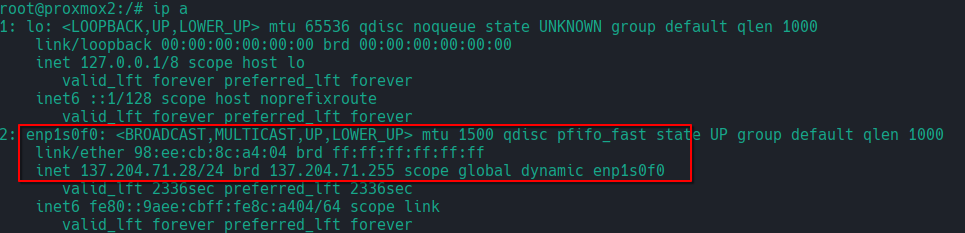

802.1X Authentication (Wired)
=============================

Due to specific constraints on our network, we need to configure **802.1X authentication** on the Proxmox server. This section will guide you through the process step-by-step.

You can skip this section if you don't need to authenticate in your network. 

1. **Install `wpa_supplicant` Package**

First, install the `wpa_supplicant` package using the following command:

.. code-block:: bash

    apt install wpasupplicant

2. **Create Configuration Directory and File**

Once the package is successfully installed, create a configuration directory and file, for example, under `/etc/wpa_supplicant`:

.. code-block:: bash

    mkdir /etc/wpa_supplicant
    touch /etc/wpa_supplicant/wpa_supplicant.conf
    chmod 600 /etc/wpa_supplicant/wpa_supplicant.conf

3. **Edit `wpa_supplicant.conf` File**

Edit the `wpa_supplicant.conf` file and add your configuration:

.. code-block:: bash

    nano /etc/wpa_supplicant/wpa_supplicant.conf

Add the following content, ensuring that your configuration matches the values expected by your authentication server:

.. code-block:: ini

    ctrl_interface=/var/run/wpa_supplicant
    ctrl_interface_group=0
    eapol_version=1
    ap_scan=0

    network={
        key_mgmt=IEEE8021X
        eap=PEAP
        identity="YourIdentity"
        password="YourPassword"
        phase2="auth=MSCHAPV2"
    }

4. **Restart `wpa_supplicant` Service**

Restart the `wpa_supplicant` service to apply the new configuration:

.. code-block:: bash

    service wpa_supplicant restart

5. **Verify the Configuration**

You can check your configuration using the following command:

.. code-block:: bash

    wpa_supplicant -i enp1s0f0 -D wired -c /etc/wpa_supplicant/wpa_supplicant.conf

6. **Configure Network Interface**

Configure your network interface to use the `wpa_supplicant` configuration. Edit the network configuration file:

.. code-block:: bash

    nano /etc/network/interfaces

Modify your interface configuration as follows:

.. code-block:: ini

    auto lo
    iface lo inet loopback

    auto enp1s0f0
    iface enp1s0f0 inet dhcp

    auto vmbr0
    iface vmbr0 inet static
        address 137.204.71.28
        netmask 255.255.255.0
        gateway 137.204.71.254
        bridge-ports enp1s0f0
        bridge-stp off
        bridge-fd 0

    wpa-iface enp1s0f0
    wpa-conf /etc/wpa_supplicant/wpa_supplicant.conf
    wpa-driver wired
    wpa-bridge vmbr0

In this setup, Proxmox requires the bridge (vmbr0) to be configured with a static IP address. However, we also need to utilize DHCP on the physical interface (enp1s0f0) to communicate with the RADIUS server for network authentication.

Specifically, the physical interface enp1s0f0 is set to obtain its IP address dynamically via DHCP, while the bridge (vmbr0) is configured with a static IP address. This static IP address assigned to vmbr0 by your DHCP server should remain consistent to ensure stable connectivity for your Proxmox server.

Ensure that your DHCP server is configured to always assign the same IP address to the MAC address of your Proxmox server. This guarantees that the Proxmox server maintains reliable network access and remains reachable within your network infrastructure.

7. **Restart Networking Service**

Restart the networking service to apply the changes:

.. code-block:: bash

    service networking restart

If the configuration is correct, your interface should now have an IP address:

Network scheme example
----------------------

This is an exemple of what your cluster could look like with this configuration and 2 nodes : 

.. image:: ./images/2_PX.png
    :alt: Proxmox Cluster
    :align: center

.. _802.1X: