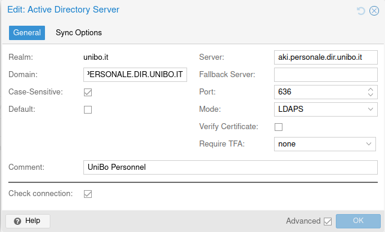
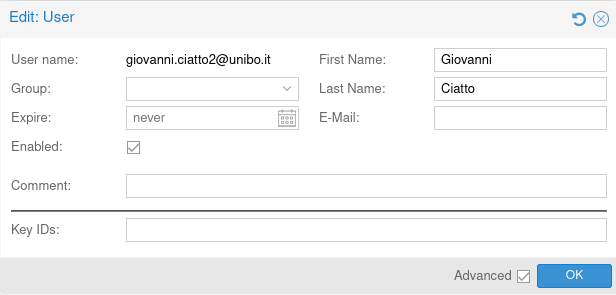

Authentication Methods
======================

Proxmox VE supports multiple authentication methods to manage user access. This section covers the different authentication methods available and provides detailed instructions on configuring each method.

Linux PAM Authentication
------------------------

Linux PAM enable the local authentication of users on a Linux system.

**Purpose**: Linux PAM is primarily used for authenticating the root user and local system users.

**Usage**: By default, Proxmox VE uses PAM for the root user authentication.

.. note::
   Linux PAM authentication is intended for local system users, especially the root user. It is not recommended to use PAM for non-root users in a production environment.

PVE Authentication
------------------

Proxmox VE (PVE) provides its own authentication realm for managing users within the PVE environment.It is enabled by default. 

**Adding PVE User**

    - Go to `Datacenter > Permissions > Users`.
    - Click **Add** to create a new user.
    - Fill in the user details such as `User ID`, `Realm` (select `PVE`), `Password`, and `Group`.
    - You now have a user that can authenticate to the Proxmox Cluster. 

LDAP Authentication
-------------------

LDAP (Lightweight Directory Access Protocol) allows the integration of an external directory service for user authentication. This is useful for environments with centralized user management.

**Adding an LDAP Server**

   - Go to `Datacenter > Permissions > Realms`.
   - Click **Add** and select **LDAP**.
   - Fill in the LDAP server details, including `Realm`, `Base Domain Name (DN)`, `Server`, `Port`, `User Attribute`

.. note::
   Ensure that the Proxmox VE server can communicate with the LDAP server over the network.

**Configure LDAP Users**:

    - Once the LDAP server is added, you can authenticate users from the LDAP directory.
    - Navigate to `Datacenter > Permissions > Users` and add users from the LDAP realm.

You can now connect using this LDAP user, make sure to choose this authentication method while connecting. 

Conclusion
----------

By understanding and configuring these authentication methods, you can efficiently manage user access in your Proxmox VE environment. Choose the appropriate authentication method based on your organizational needs and security requirements.

In the next section, we will cover user management in Proxmox.
