Setting Up Proxmox Backup Server
================================

Proxmox Backup Server (PBS) is a dedicated backup solution designed to provide efficient and reliable backups for Proxmox Virtual Environment (PVE) and other virtualized infrastructures. This guide will walk you through the steps to set up and configure a Proxmox Backup Server.

Installing Proxmox Backup Server
--------------------------------

1. **Download the Proxmox Backup Server ISO**:
   - Visit the `Proxmox Download page <https://www.proxmox.com/en/downloads>`_ and download the latest Proxmox Backup Server ISO image.

2. **Create a Bootable USB Drive**:

   - Use a tool like `Ventoy <https://www.ventoy.net>`_ (Linux) or `Rufus <https://rufus.ie>`_ (Windows) to create a bootable USB stick from the downloaded ISO.

3. **Install Proxmox Backup Server**:

   - Boot from the USB drive on the server where you want to install PBS.

   - Follow the installation prompts to complete the setup.

.. note::
   Ensure that your server meets the minimum system requirements for running Proxmox Backup Server.

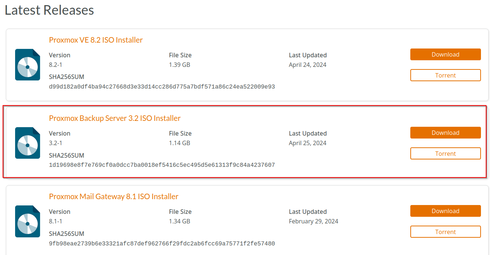

Configuring Proxmox Backup Server
---------------------------------

1. **Initial Setup**:
   - After installation, access the PBS web interface using the IP address of your PBS server (https://<PBS-IP>:8007).
   - Log in with the root user and the password you set during installation.

2. **Adding a User**:
   - It is recommended to create a dedicated user for backup operations instead of using the root account.
   - Navigate to `Datacenter > Permissions > Users` and add a new user.

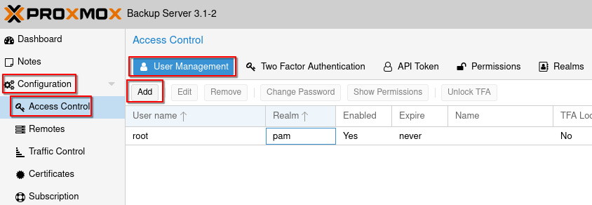

3. **Creating a DataStore**:
   - A datastore is a storage location for backups. To create one, go to `Datacenter > Storage` and click **Add**.
   - Configure the datastore settings and click **Add**.

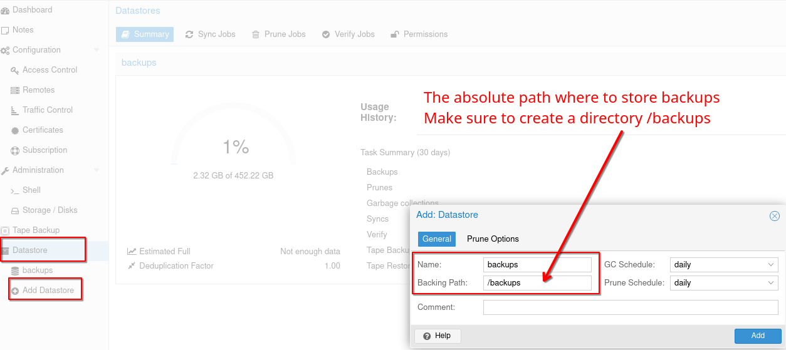

4. **Modifying DataStore Permissions**:
   - Assign permissions to the newly created user. Go to `Datacenter > Permissions > Add` and select the datastore.
   - Assign `DataAdmin` rights to the user.

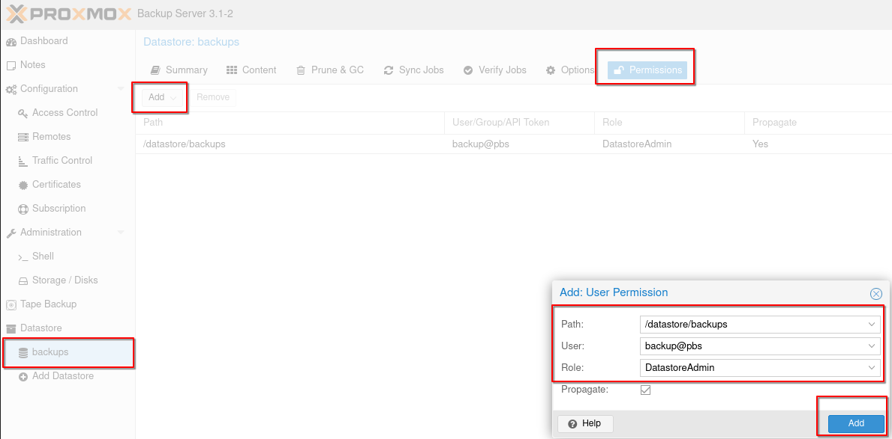

5. **Copy the Proxmox Backup Server Fingerprint**:
   - Navigate to `Datacenter > Dashboard` and copy the server fingerprint.
   - This fingerprint will be used to authenticate the connection between Proxmox VE and PBS.

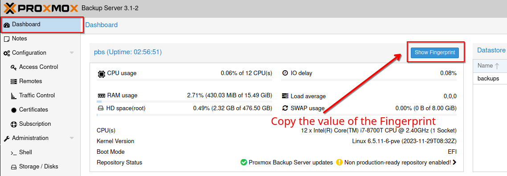

Connecting Proxmox VE to Proxmox Backup Server
----------------------------------------------

1. **Add PBS as a Storage Target in PVE**:
   - Log in to your Proxmox VE web interface.
   - Navigate to `Datacenter > Storage` and click **Add**.
   - Select **Proxmox Backup Server** as the storage type.

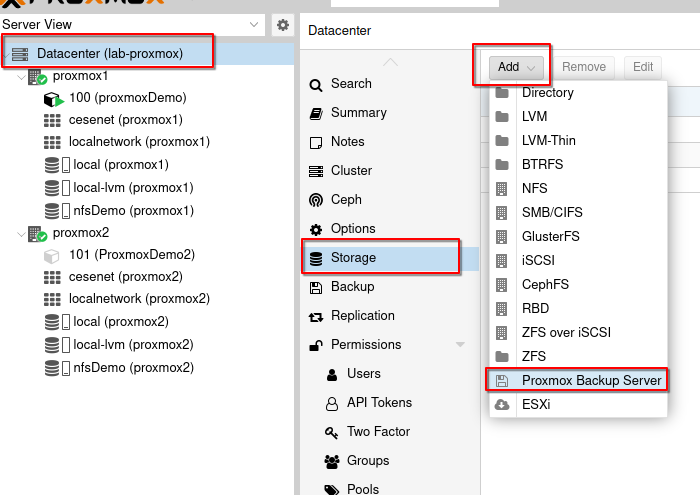

2. **Configure PBS Storage**:
   - **ID**: Enter a name for the storage.
   - **Server**: Enter the IP address or hostname of your PBS server.
   - **Datastore**: Enter the datastore name configured on your PBS.
   - **Username**: Enter the username configured on your PBS.
   - **Password**: Enter the password configured on your PBS.
   - **Fingerprint**: Paste the fingerprint of your PBS.

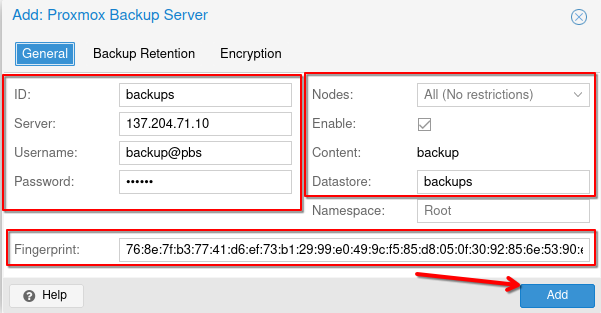

3. **Test the Connection**:
   - Click **Add** to save the configuration.
   - Ensure that the storage is listed and accessible in the Proxmox VE storage list.

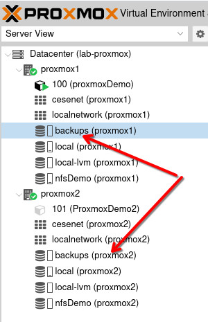

Creating Backup Jobs
--------------------

1. **Create a Backup Job in PVE**:
   - Navigate to `Datacenter > Backup` and click **Add**.
   - Configure the backup job settings:
     - **Storage**: Select the PBS storage.
     - **Schedule**: Set the backup schedule.
     - **Selection Mode**: Choose the VMs or containers to be backed up.
   - Select the VMs or containers to add to the backup job.

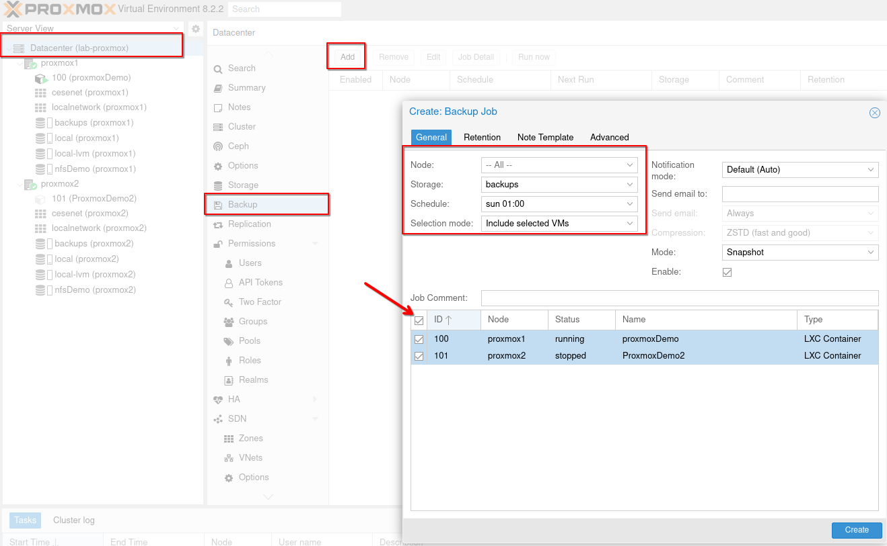

2. **Monitor Backup Jobs**:
   - After creating the backup job, monitor its status in `Datacenter > Backup`.
   - Check the logs for any errors or warnings.

3. **Create Backup Manually**:
   - You can also create backups manually. Navigate to your container/VM > `Backup` and click **Backup now**.

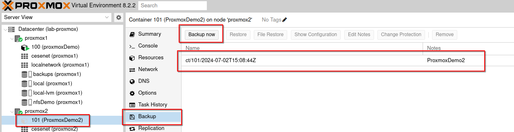

Restoring from Backup
---------------------

1. **Restore a VM or Container**:
   - Navigate to your container/VM > `Backup`.
   - Select the desired snapshot.
   - Click **Restore**.

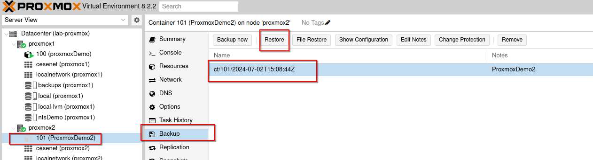

Conclusion
----------

By following these steps, you have successfully set up a Proxmox Backup Server and integrated it with your Proxmox VE environment. This setup ensures reliable and efficient backups for your virtual machines and containers, providing robust data protection and recovery capabilities.

In the next section, we will cover user management in Proxmox.
