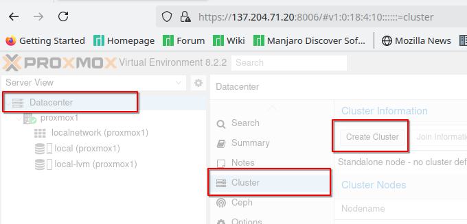
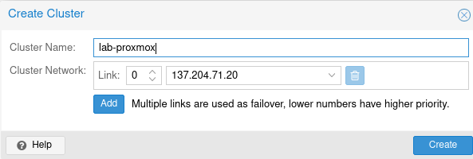
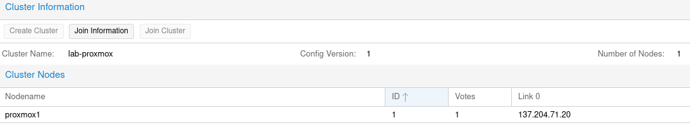
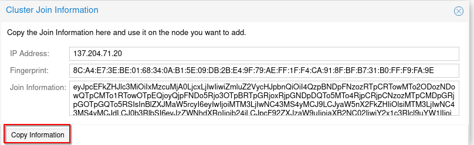
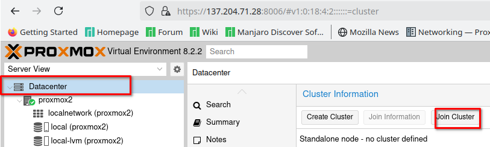
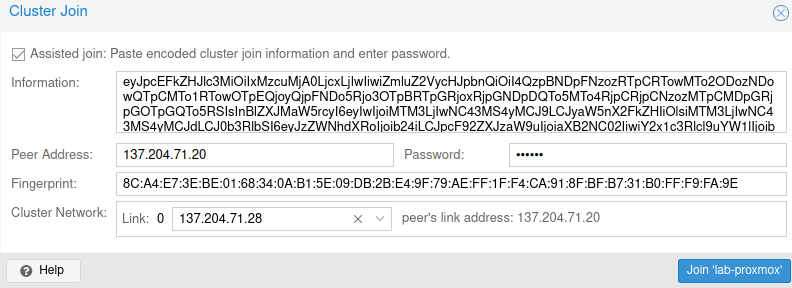
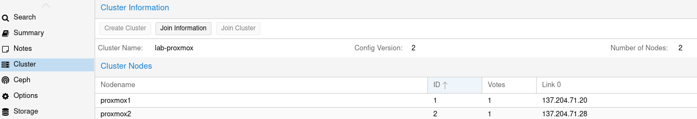

======================
Proxmox Cluster Guide
======================

Introduction
============

Proxmox VE enables the creation of clusters consisting of multiple Proxmox servers, offering significant advantages over single-node setups, particularly in environments requiring high availability, scalability, and centralized management. Here's why creating a Proxmox cluster is beneficial:

**High Availability (HA)**:
    - **Fault Tolerance:** VMs and containers can be automatically live-migrated to another node in case of hardware failures or maintenance, minimizing downtime.
    - **Redundancy:** Multiple nodes provide redundancy, ensuring that services remain operational even if one node fails.

**Resource Scaling**:
    - **Load Balancing:** Distribute VMs and containers across multiple servers to optimize resource utilization and enhance performance.
    - **Scalability:** Easily add new nodes to the cluster as your workload grows, horizontally scaling CPU, RAM, and storage resources.

**Centralized Management**:
    - **Single Interface:** Manage and monitor all cluster nodes through Proxmox VE's web interface, streamlining administration and reducing operational complexity.
    - **Unified Storage:** Utilize shared storage solutions like Ceph or NFS, allowing VMs consistent access to data regardless of their running node, enhancing flexibility and data integrity.

This guide details the process of creating a Proxmox cluster and adding nodes to it.

Creating a Proxmox Cluster
===========================

**Configure Network:**

Ensure all servers are on the same subnet and can communicate with each other.

**Enable Proxmox Cluster:**

Log in to the Proxmox web interface (`https://<your-proxmox-ip>:8006`) with root credentials.

**Create the Cluster:**

Navigate to `Datacenter` > `Cluster` > `Create`.

Provide a name and IP for the cluster, then click **Create**.

You should now see the newly created cluster.

To add a new node to the cluster, copy the "Join Information" for the next step.

Joining a Proxmox Server to an Existing Cluster
===============================================

**Add Node to Existing Cluster:**

Copy the cluster's join information.

Log in to the Proxmox web interface of the node you wish to add, then navigate to `Datacenter` > `Cluster` > `Join Cluster`.

Next, paste the 'Join Information' from the master Proxmox server.

Ensure the following details match:

- Peer Address: Address of the master server

- Password: Root password of the master server

- Fingerprint: Compare with the master server's fingerprint (found in 'Join Information')

- Cluster Network: IP address of the current node

**Verify Cluster Status:**
After adding the new node, verify its status in the cluster interface to ensure synchronization and operational readiness.

Navigate to `Datacenter` > `Cluster` to view both nodes.

Conclusion
==========

Following these steps enables you to create a Proxmox cluster and expand it with additional nodes, facilitating centralized management and improving reliability across your virtualization environment.

In the next section, we will cover how to set up the network for the Proxmox cluster.