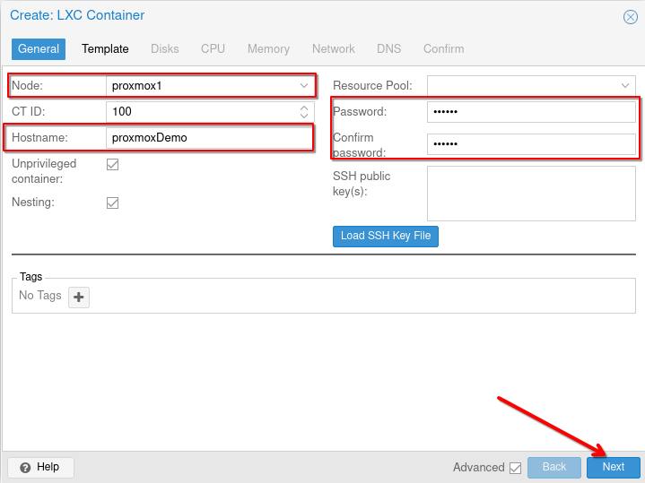

Testing Your Proxmox Cluster and SDN with a Container
=====================================================

Now that you have a functioning cluster and a fully operational Software-Defined Network (SDN), let's create a container to test the setup.

Understanding Storage Options
-----------------------------

In your Proxmox cluster, you will notice that two local storage options are present on each node:

**Local Storage (`local`)**:
   - This storage is typically used for storing configuration files, ISO images, container templates, and backups. It resides on the root file system of the Proxmox node and is not shared across the cluster.

**Local-LVM Storage (`local-lvm`)**:
   - This storage is used for storing virtual machine (VM) and container disk images. It utilizes Logical Volume Management (LVM) to manage storage space, allowing for flexible volume resizing and efficient storage utilization. This storage is also local to each node and not shared across the cluster.

By understanding these storage options, you can better manage your virtual machines and containers in a clustered environment. We will cover how to manage these volumes and add new ones later.

Downloading Container Template
------------------------------

To add a container template, navigate to `Datacenter > yourserver > local > CT Template` and click **Templates**.

You will find a list of up-to-date container templates available for download. Once downloaded, these templates will be ready for easy deployment.

Choose any template from the list you want to download. Here, we chose Rocky Linux 9.

Wait for the download to complete; this could take a few minutes. Once downloaded, exit the template window.

Now, you can use this template to create a container.

We will use a simple configuration and not go through all the different options. Some will be covered in the next sections.

Creating a Container with SDN
-----------------------------

1. **General Settings**:
    - **Node**: Select the node where you want to create your container. It must be the same node where you downloaded the container template, as it is stored in local storage.
    - **Hostname**: Enter the hostname of the container.
    - **Password**: Set the password for the root user.

2. **Template Selection**:
    - Choose your template from the list.

3. **Storage**:
    - Select `local-lvm` as your container storage.

4. **Network**:
    - **Name**: Enter the interface name.
    - **Bridge**: Choose the name of the SDN you created.
    - **IPv4**: Ensure the DHCP option is checked.

5. **Confirmation**:
    - Review your configuration details. You can check the "Start after created" option to start the container automatically. Then press **Finish**.

You should see the message "TASK OK".

Sometimes, the container might not start automatically even with the "Start after created" option. In that case, you can start it manually.

Accessing and Testing the Container
-----------------------------------

Access your container terminal by clicking on your container and then selecting **Console**. You can also open the terminal by double-clicking on the container.

**Verification**:

- Check that the first IP of the pool defined in the SDN section has been assigned to your container.

- Test the NAT configuration by pinging an external IP.

New Network Scheme
------------------

You're new network scheme should be the following : 

Conclusion
----------

You have successfully created and tested a container within your Proxmox cluster using the SDN configuration. This ensures that your cluster and SDN setup are functioning correctly.

In the next section, we will cover how to create an other type of SDN, EVPN, which allow you to have full connectivity over your network. 