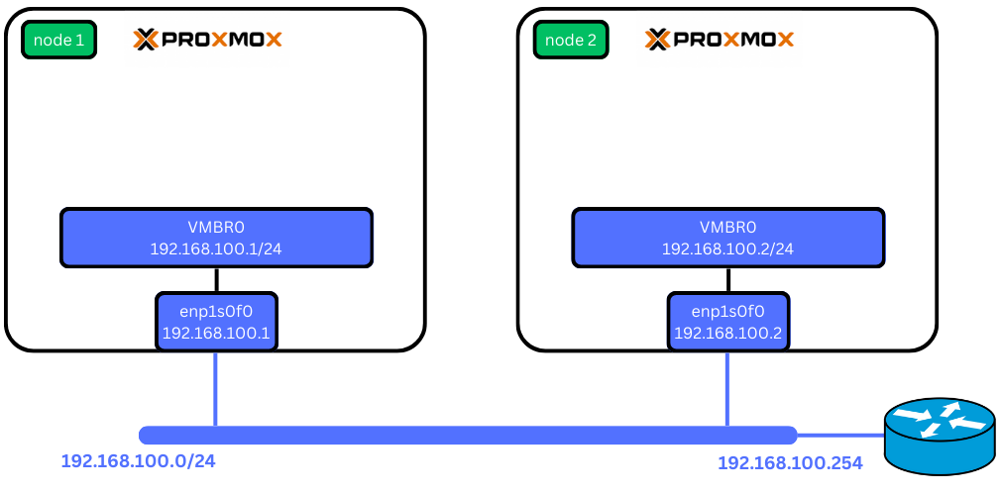
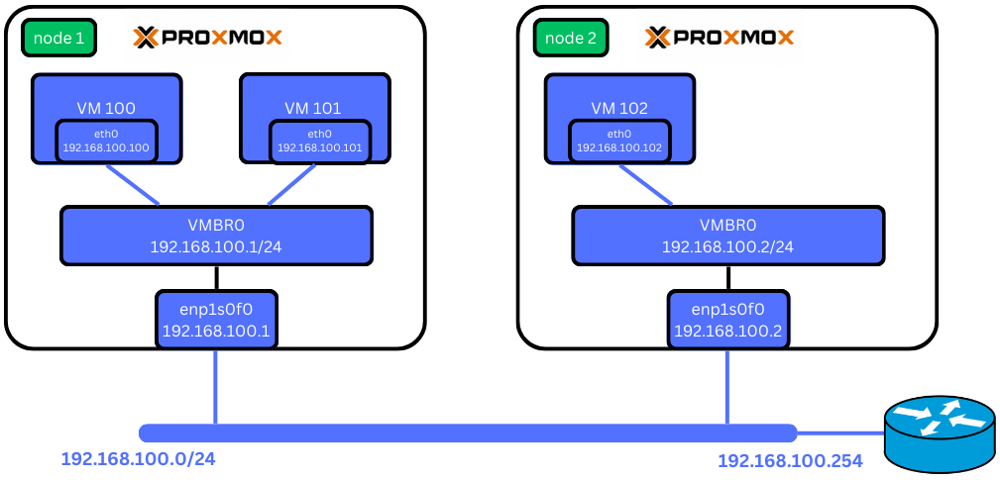

Default Network Configuration
=============================

The default configuration in `/etc/network/interfaces` should be as follows:

.. code-block:: ini

    auto lo
    iface lo inet loopback

    auto enp1s0f0
    iface enp1s0f0 inet manual

    auto vmbr0
    iface vmbr0 inet static
        address 192.168.100.1
        netmask 255.255.255.0
        gateway 192.168.100.254
        bridge_ports enp1s0f0
        bridge_stp off
        bridge_fd 0

**`vmbr0` is a bridge interface** used by Proxmox for various purposes and should not be removed. The IP address assigned to `vmbr0` is the one configured during the initial Proxmox installation.

**Important:**
Removing or editing the `vmbr0` bridge in Proxmox can disrupt network connectivity for VMs, containers, and management interfaces. This can lead to potential instability and loss of access. It is crucial to maintain this default configuration unless you have a deep understanding of the implications and a proper plan for reconfiguration and recovery.

Network Layout
==============

With this configuration and two Proxmox nodes connected to a switch, your network should resemble the following:

When creating a VM or container, you will use the bridge (`vmbr0`) to connect the VM to the network. You can assign each VM a static local IP or configure a DHCP server. In the example below, we have created two VMs on node 1 and one VM on node 2:

Each VM should be able to communicate with each other through the bridge.

Specific Configuration: 802.1X Authentication
=============================================

While the above configuration is correct for most setups, there are scenarios where specific configurations are required. For example, in a setup that requires authentication with a RADIUS server using 802.1X. This specific configuration will be covered in the next section.
