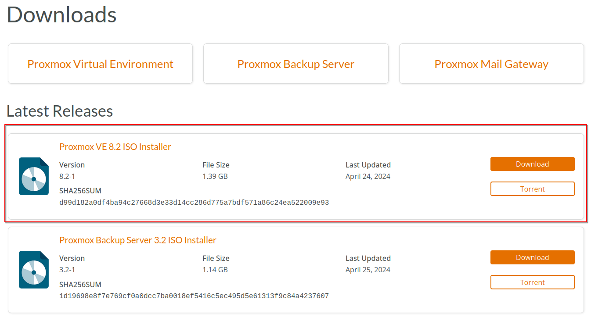
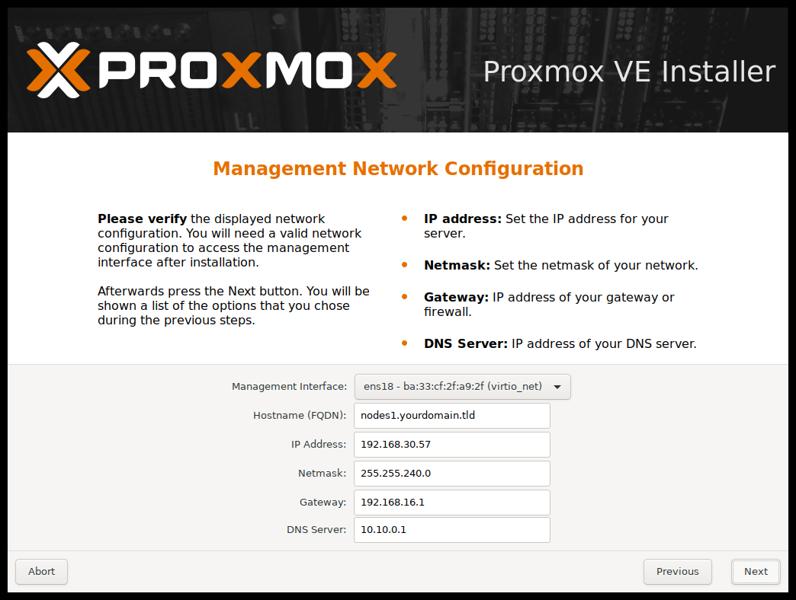
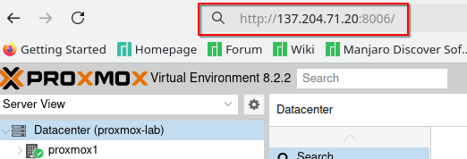

Proxmox Installation Guide
==========================

1. **Prepare Installation Media**
--------------------------------
- **Download Proxmox ISO**: Go to the [Proxmox VE download page](https://www.proxmox.com/en/downloads) and download the latest ISO image.
- **Create Bootable Media**: Use a tool like Ventoy (Linux) or Rufus (Windows) to create a bootable USB stick from the downloaded ISO.

2. **Boot from Installation Media**
----------------------------------
- Insert the bootable USB stick into your server.
- Boot the server and enter the BIOS/UEFI setup to set the USB stick as the primary boot device.
- Save changes and restart the server. The Proxmox installer should start.

3. **Install Proxmox VE**
------------------------
- **Welcome Screen**: Select "Install Proxmox VE" and press Enter.
- **EULA**: Read and accept the End User License Agreement (EULA) to proceed.
- **Target Hard Disk**: Select the hard disk where you want to install Proxmox. This will erase all data on the selected disk.
- **Country, Time Zone, and Keyboard Layout**: Choose your country, time zone, and keyboard layout.
- **Administrator Password and Email**: Set the root password and enter an email address for system notifications.
- **Network Configuration**: Configure the network settings:
- Enter the management IP address, netmask, gateway, and DNS server.
- Choose the hostname for your Proxmox server.

- **Start Installation**: Review the summary and click "Install" to begin the installation. This process will take several minutes.

4. **Initial Setup and Access**
------------------------------
- **Reboot**: After installation completes, remove the installation media and reboot the server.
- **Access Web Interface**: Once the server boots up, access the Proxmox web interface from a browser on a computer on the same network:

.. code-block:: bash

    https://<your-proxmox-ip>:8006

- **Login**: Use `root` as the username and the password you set during installation.

5. **Post-Installation Configuration**
-------------------------------------
- **Update Proxmox VE**:
- Open a terminal on the Proxmox server or use SSH to connect.
- Update the package lists and upgrade all installed packages:

.. code-block:: bash

    sudo apt update
    sudo apt full-upgrade -y

- **Subscription Notice**: If you don't have a Proxmox subscription, you need to disable the subscription notice. Otherwise, Proxmox won't be able to download any packages from the repository.

.. code-block:: bash

    sudo rm /etc/apt/sources.list.d/pve-enterprise.list
    echo "deb http://download.proxmox.com/debian/pve bookworm pve-no-subscription" | sudo tee -a /etc/apt/sources.list
    sudo apt update

By following these steps, you will have a fully functional Proxmox VE server ready for creating and managing virtual machines and containers, and joining a cluster.
