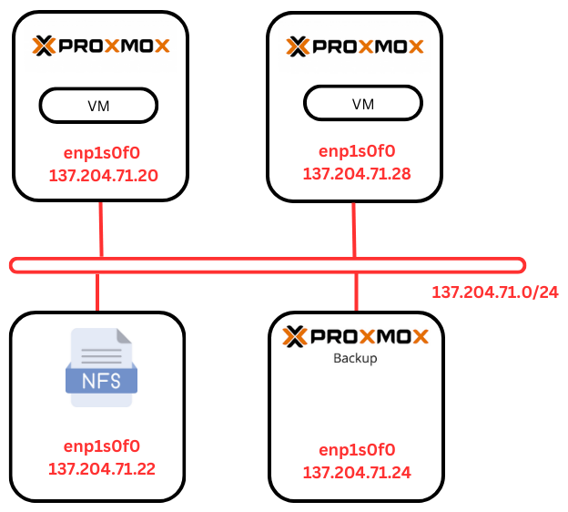
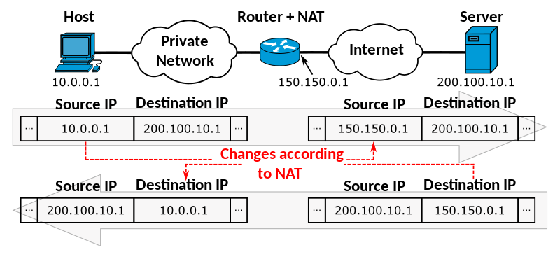

Networking
==========

.. _Networking:

Network Scheme
--------------

The Proxmox VE servers, Proxmox Backup Server, and the NFS server are all located in the same network and connected to a switch.



In this section, we will cover how to configure the various components of the Proxmox lab.

 802.1X Authentication
 =====================

 Due to specific constraints on our network, we need to configure **802.1X authentication** on the Proxmox server. This section will guide you through the process step-by-step.

 1. **Install `wpa_supplicant` Package**

    First, install the `wpa_supplicant` package using the following command:

    ```
    sudo apt install wpasupplicant
    ```

 2. **Create Configuration Directory and File**

    Once the package is successfully installed, create a configuration directory and file, for example, under `/etc/wpa_supplicant`:

    ```
    sudo mkdir /etc/wpa_supplicant
    sudo touch /etc/wpa_supplicant/wpa_supplicant.conf
    sudo chmod 600 /etc/wpa_supplicant/wpa_supplicant.conf
    ```

 3. **Edit `wpa_supplicant.conf` File**

    Edit the `wpa_supplicant.conf` file and add your configuration:

    ```
    sudo nano /etc/wpa_supplicant/wpa_supplicant.conf
    ```

    Add the following content, ensuring that your configuration matches the values expected by your authentication server:

    ```
    ctrl_interface=/var/run/wpa_supplicant
    ctrl_interface_group=0
    eapol_version=1
    ap_scan=0

    network={
       key_mgmt=IEEE8021X
       eap=PEAP
       identity="YourIdentity"
       password="YourPassword"
       phase2="auth=MSCHAPV2"
    }
    ```

 4. **Restart `wpa_supplicant` Service**

    Restart the `wpa_supplicant` service to apply the new configuration:

    ```
    sudo service wpa_supplicant restart
    ```

 5. **Verify the Configuration**

    You can check your configuration using the following command:

    ```
    sudo wpa_supplicant -i enp1s0f0 -D wired -c /etc/wpa_supplicant/wpa_supplicant.conf
    ```

 6. **Configure Network Interface**

    Configure your network interface to use the `wpa_supplicant` configuration. Edit the network configuration file:

    ```
    sudo nano /etc/network/interfaces
    ```

    Modify your interface configuration as follows:

    ```
    auto enp1s0f0
    iface enp1s0f0 inet dhcp
       wpa-conf /etc/wpa_supplicant/wpa_supplicant.conf
       wpa-driver wired
    ```

 7. **Restart Networking Service**

    Restart the networking service to apply the changes:

    ```
    sudo service networking restart
    ```

 If the configuration is correct, your interface should now have an IP address:

 .. image:: ./images/interface.png
    :alt: IP address
    :align: center


.. _802.1X:

Bridge Configuration
--------------------

Due to a limited number of available IP addresses from our network pool and the need for VMs and containers to have IP addresses, we created a network bridge on each node. A network bridge acts as a virtual switch that allows you to connect all your VMs and containers. Each bridge is assigned a local IP address. At this stage, VMs connected to the bridge can communicate with each other but cannot access external networks. To enable external communication, we need to configure **Network Address Translation (NAT)**.

.. _Bridge:

Network Address Translation (NAT)
---------------------------------

**Network Address Translation (NAT)** allows multiple devices on a local network to share a single public IP address for accessing external networks. It modifies the IP address information in the headers of IP packets while they are in transit, enabling the devices to communicate with external networks while preserving the limited pool of IP addresses.




.. _NAT:

----------------
