===========================
Proxmox Network Configuration Guide
===========================

Introduction
============

Once you have a working Proxmox cluster, configuring the network is essential to:

- Enable communication between containers and VMs on the same node.
- Enable communication between containers and VMs on different nodes.
- Provide internet access to containers and VMs.
- Set up DHCP.

Current Network Configuration
=============================

Each server has only one network interface (NIC) and a bridge. The interface is configured via DHCP, and the bridge is linked to the interface.

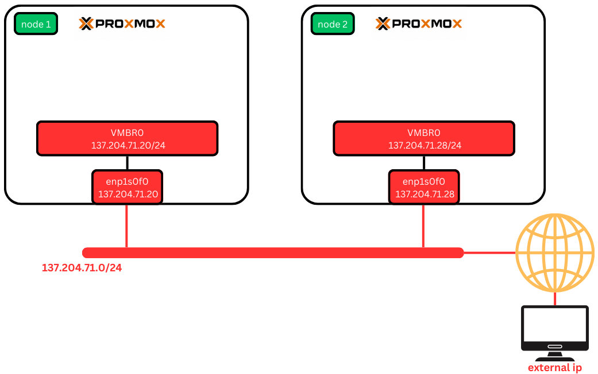

You can check your network configuration in `Datacenter > Servername > Network`:

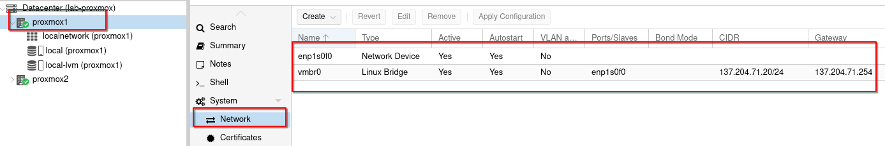

The Issue
---------

The main issue here is the limited IP pool, which restricts configuring VMs with IPs from the same network. To solve this, we need to create a local network using Software-Defined Networking (SDN).

Software-Defined Networking (SDN)
=================================

What is SDN?
------------

**Software-Defined Networking (SDN)** in Proxmox allows you to create a flexible and scalable network. It separates the control plane from the data plane, enabling centralized management of network resources.

Creating an SDN Zone
--------------------

To create your SDN, follow these steps:

1. **Navigate to Datacenter > SDN > Zones and click "Add"**:

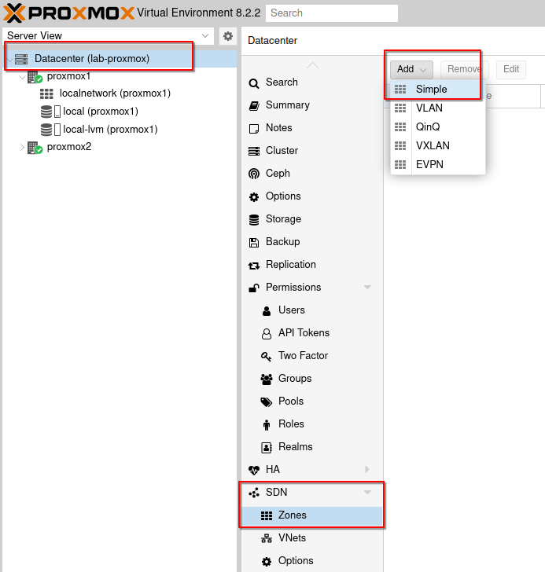

2. **Choose the "Simple" option**:

   - **Id**: The name of the Zone.
   - **Nodes**: Select the nodes you want to add to your SDN.
   - **IPAM**: Choose the IP Address Management method.

You can also add a DNS and reverse DNS. Make sure to choose the **"Automatic DHCP"** option to allow your VMs and LXC containers to be automatically configured via DHCP. Once done, click **"Add"**.

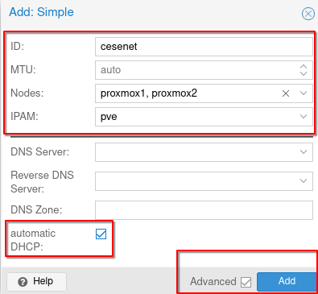

Adding a Virtual Network (VNets)
--------------------------------

Next, you need to add a Virtual Network (VNet):

1. **Navigate to Datacenter > SDN > VNets and click "Create"**:

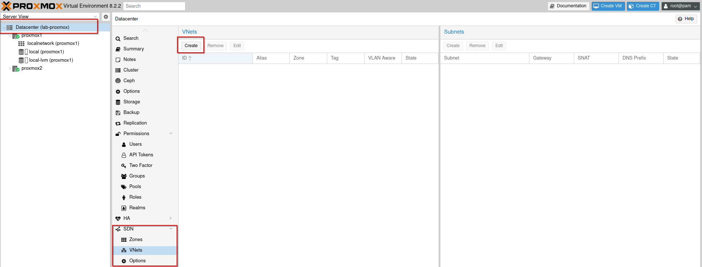

2. **Configure the VNet**:

   - **Name**: Can be the same as the Zone.
   - **Zone**: Select the Zone where you want to set the VNet.

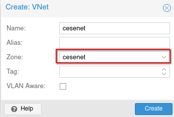

Adding a Subnet
---------------

Once the VNet is created, you need to add a Subnet:

1. **Select the VNet and click "Create" in the Subnet section (right)**:

.. image:: ./images/VNETS_created.png
    :alt: VNets
    :align: center

2. **Configure the Subnet**:

   - **Subnet**: Specify the IP/Mask of the VNet.
   - **Gateway**: Define the gateway.
   - **SNAT**: Enable Source Network Address Translation (SNAT). SNAT allows multiple devices on a local network to share a single public IP address for accessing external networks.

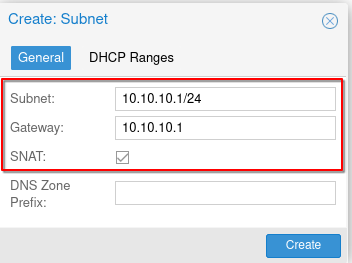

Setting DHCP Ranges
-------------------

Configure the range of IP addresses for your cluster:

1. **Go to "DHCP Ranges" and set the range of IP addresses for your cluster**.
2. **Click "Create"**.

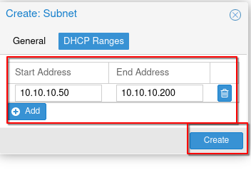

Applying the Configuration
--------------------------

After configuring your VNets and Subnets, applyConclusion
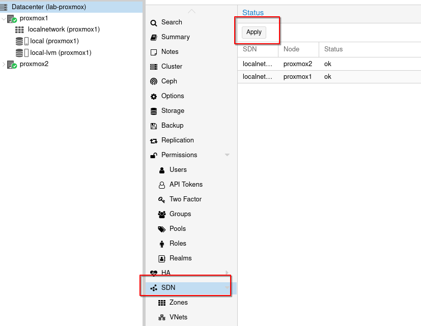

After a few seconds, you should see a success message:

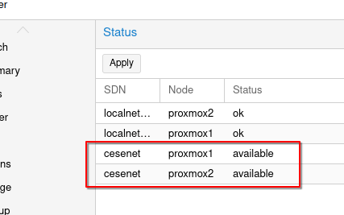

New Network Scheme
------------------

A SDN with the ip you've defined have been created on each of your node. Your network should now look the following. 

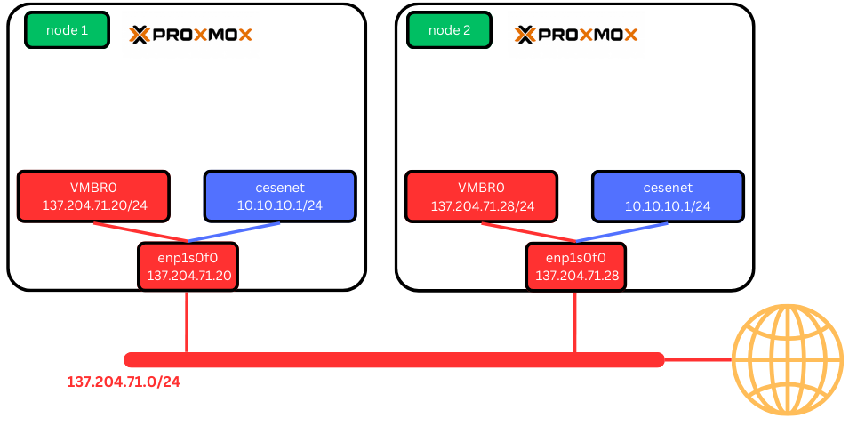

Conclusion
==========

By following these steps, you can configure your Proxmox network to enable efficient communication and management of your VMs and containers. Leveraging Software-Defined Networking (SDN) provides flexibility, scalability, and centralized control, ensuring your virtual environment is robust and easy to manage.

Your Software-Defined Network (SDN) is now fully operational. The next step is to create a container utilizing this SDN configuration.
