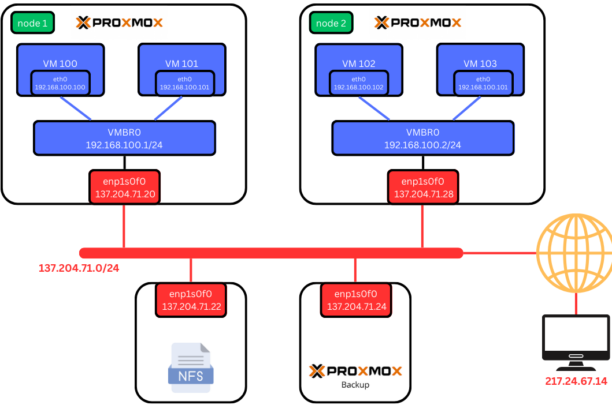

Networking
==========

.. _Networking:

Network Scheme
--------------

The Proxmox VE servers, Proxmox Backup Server, and the NFS server are all located in the same network and connected to a switch.

In this section, we will cover how to configure the various components of the Proxmox lab.

Bridge Configuration
--------------------

Due to a limited number of available IP addresses from our network pool and the need for VMs and containers to have IP addresses, we created a network bridge on each node. A network bridge acts as a virtual switch that allows you to connect all your VMs and containers. Each bridge is assigned a local IP address. At this stage, VMs connected to the bridge can communicate with each other but cannot access external networks. To enable external communication, we need to configure **Network Address Translation (NAT)**.

.. _Bridge:

.. image:: ./images/nat.png
   :alt: Network Address Translation
   :align: center

Network Address Translation (NAT)
---------------------------------

**Network Address Translation (NAT)** allows multiple devices on a local network to share a single public IP address for accessing external networks. It modifies the IP address information in the headers of IP packets while they are in transit, enabling the devices to communicate with external networks while preserving the limited pool of IP addresses.

.. _NAT:

----------------
