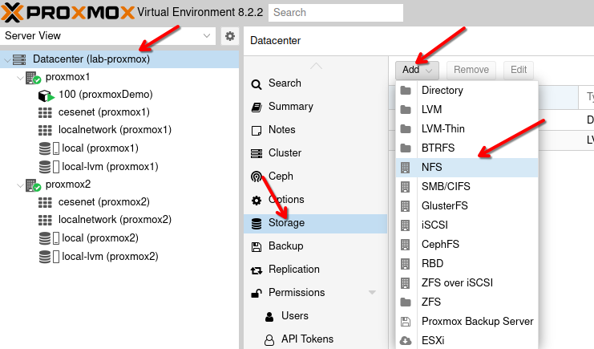
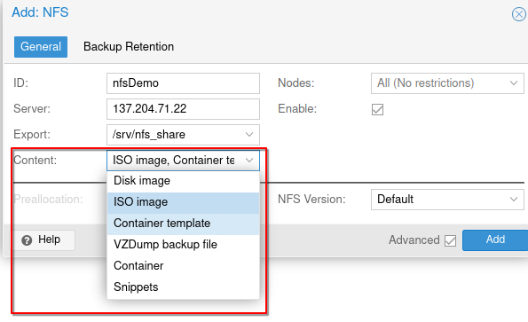
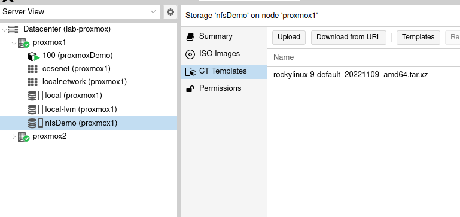
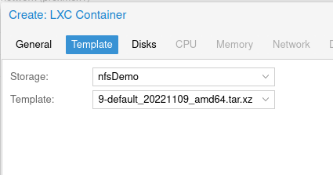
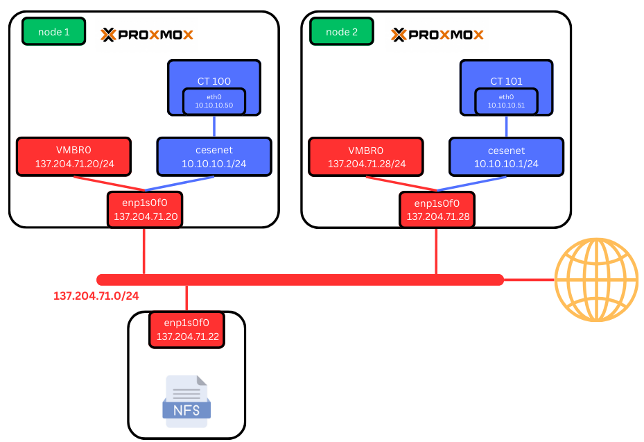

Adding an NFS Storage to Your Proxmox Cluster
=============================================

This section covers how to add an NFS (Network File System) storage to your Proxmox cluster. NFS is commonly used to share files over a network and is ideal for storing ISO images, backups, and container templates.

Configuring NFS Storage
------------------------

1. **Navigate to Storage Settings**:
   - Go to `Datacenter > Storage` in the Proxmox web interface.

2. **Add New Storage**:
   - Click **Add** and choose **NFS** from the dropdown menu. There are many types of storage you can add, but for this guide, we will focus on NFS.

3. **Set NFS Storage Options**:
   - You will be prompted to set several parameters:

     - **ID**: The name of the NFS storage.
     - **Server**: The IP address of the NFS server.
     - **Export**: Use `/srv/nfs_share` or the appropriate export path on your NFS server.
     - **Content**: Select the types of content you want to store on your NFS server.

.. image:: ./images/options.png
    :alt: NFS options
    :align: center

   The available content types include:
   - ISO image
   - Container template
   - Backups
   - Disk image

   In the following example, we chose to store ISO images and container templates.

Testing Your NFS Storage
------------------------

After adding the NFS storage, it's a good practice to test it to ensure everything is configured correctly.

1. **Download a New Template**:
   - Download a new container template to your NFS storage.

2. **Create a New Container**:
   - Use the downloaded template to create a new container on any node in your cluster.

New Network Scheme
------------------

You're new network scheme should be the following : 

Conclusion
----------

By following these steps, you have successfully added an NFS storage to your Proxmox cluster and verified its functionality by downloading a template and creating a container.

In the next section, we will see how to set up and add a Proxmox Backup Server.
