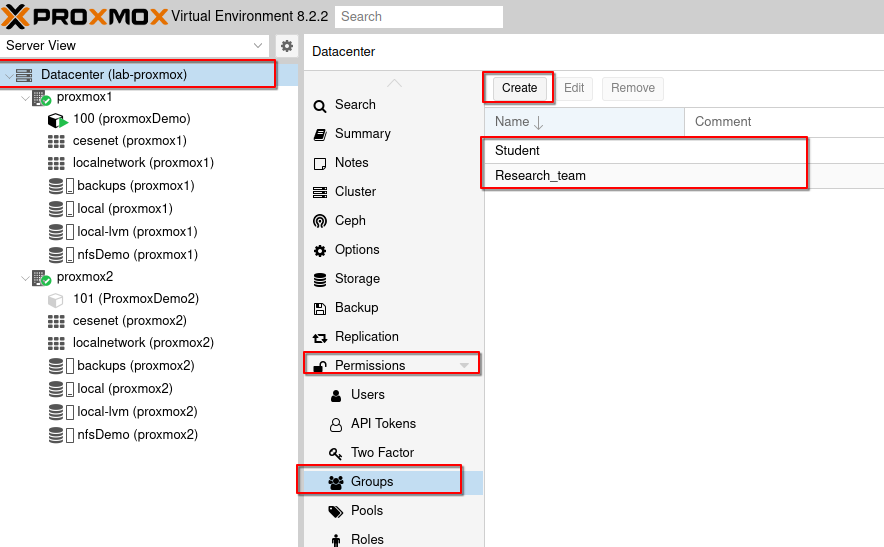
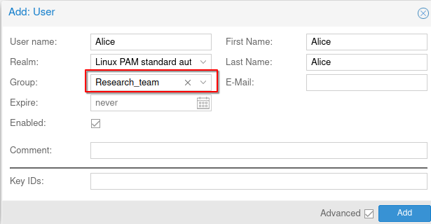

User Management in Proxmox VE
=============================

Proxmox VE offers extensive user management capabilities, allowing fine-grained control over user permissions and access. This section covers various aspects of user management, including creating groups and users, and configuring permissions.

Creating Groups
---------------

Groups simplify the management of privileges for multiple users. Follow these steps to create a group:

1. **Navigate to Group Management**:

   - Go to `Datacenter > Permissions > Groups`.

2. **Create a New Group**:

   - Click **Create** and enter a name for the group.

For this documentation, we created two groups:

- **Research_team**
- **Student**

You can assign users to these groups when creating them or by editing existing users to include them in a group.

For this example, we created three users:

- **Members of the "Research_team" group**:

  - Alice
  - Bob

- **Member of the "Student" group**:

  - Toto

Permissions Management
----------------------

By default, users have no permissions and can only connect to the cluster. Detailed information about permissions and privileges is available in the official Proxmox documentation: https://pve.proxmox.com/wiki/User_Management.

You can manage privileges in two places:

- `Datacenter > Permissions`
- By clicking on a component (Storage, Network, VM, LXC, Pools, etc.) and navigating to Permissions.

In this example, we will set the minimum permissions to allow the Research_team to:

- Create VM/LXC containers on local-lvm storage
- Use NFS storage to store and use Templates/ISOs
- Use and create backups
- Use the SDN to configure VM/LXCs

Step-by-Step Permissions Configuration
--------------------------------------

1. **Create a Resource Pool**:

   Resource pools help organize and manage resources within Proxmox VE. They allow you to group resources and control access.

   - Navigate to `Datacenter > Permissions > Pools`.
   - Click **Create** and enter a name for the pool.

   .. image:: ./images/pool.png
       :alt: Creating a Resource Pool
       :align: center

2. **Configure Resource Pool Permissions**:

    - Go to the newly created resource pool.
    - Navigate to `Permissions` and click **Add**.
    - Configure permissions for the "Research_team" group:
    1. `PVEPoolUser`: Allows the group to use the pool.
    2. `PVEVMAdmin`: Allows members to create and manage VMs/LXCs within the pool.

   .. image:: ./images/pool2.png
       :alt: Configuring Resource Pool Permissions
       :align: center

3. **Configure NFS Storage Permissions**:

    - Go to the NFS storage.
    - Navigate to `Permissions` and click **Add**.
    - Add the following permissions for the "Research_team" group:
    1. `PVEDatastoreAdmin`: Allows using and storing LXC templates and VM ISOs.
    2. `PVETemplateUser`: Allows cloning container/VM templates stored on this storage.

   .. image:: ./images/nfs_perm.png
       :alt: Configuring NFS Storage Permissions
       :align: center

4. **Configure Local-lvm Storage Permissions**:

    - Go to local-lvm storage.
    - Navigate to `Permissions` and click **Add**.
    - Add the following permissions for the "Research_team" group:
    1. `PVEDatastoreAdmin`: Allows using this storage for LXC/VM storage.
    2.  `PVEVMAdmin`: Allows creating, modifying, and using LXCs/VMs.

   .. image:: ./images/locallvm_perm.png
       :alt: Configuring Local-lvm Storage Permissions
       :align: center

5. **Configure Backup Storage Permissions**:

    - Go to the backup storage.
    - Navigate to `Permissions` and click **Add**.
    - Add the following permission for the "Research_team" group:
    1. `PVEDatastoreAdmin`: Allows using this storage for backups.

   .. image:: ./images/backup_perm.png
       :alt: Configuring Backup Storage Permissions
       :align: center

6. **Configure SDN Permissions**:

    - Go to your SDN.
    - Navigate to `Permissions` and click **Add**.
    - Add the following permission for the "Research_team" group:
    1. `PVESDNUser`: Allows using the SDN to configure LXCs/VMs.

   .. image:: ./images/SDN_perm.png
       :alt: Configuring SDN Permissions
       :align: center

7. **Create an LXC to Test Permissions**:

   - Log in to the Proxmox GUI with a user from the "Research_team" group.
   - Click **Create CT** in the upper right corner.
   - Use the resource pool you created.

   .. image:: ./images/create_CT_pool.png
       :alt: Creating a Container
       :align: center

8. **Additional Use Cases for Permissions, Privileges, and Pools**:

   - Create pools for specific users to restrict access to their own LXC/VMs.
   - Set specific privileges for a user group after the virtual network has been created.
   - These examples highlight Proxmox's detailed user privilege management capabilities.

Conclusion
----------

Proxmox VE's user management system is robust and versatile, enabling detailed control over user permissions and access. By following these steps, you can effectively manage user roles and ensure a secure and organized virtual environment.

In the next section, we will cover how to import and use an ISO image.
